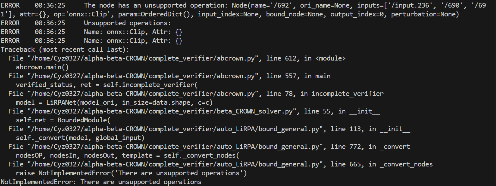
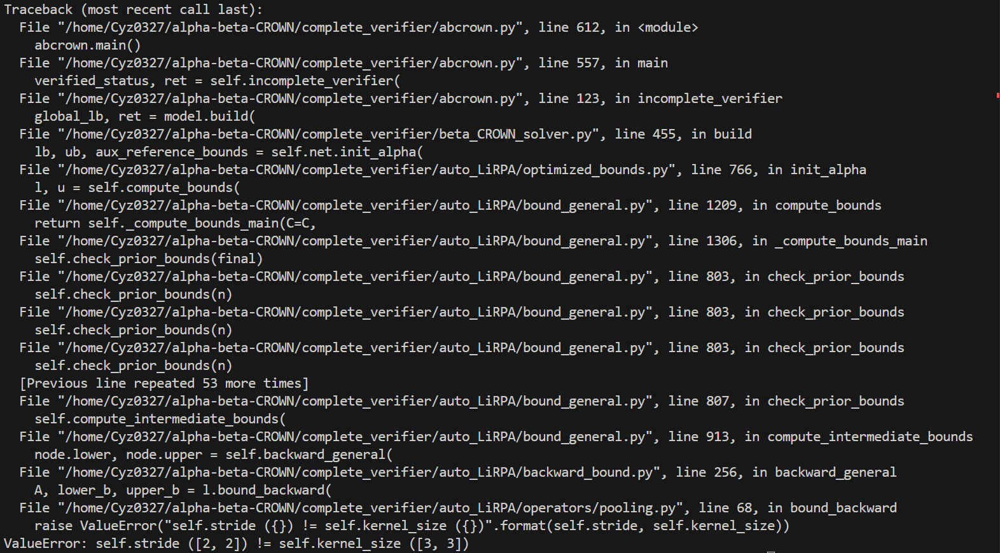

# 说明
1. 工具运行需求参见 ``./complete_verifier/environment.yaml`` ，使用`conda`创建虚拟环境：
```shell
conda deactivate
conda env remove --name abcrown
conda env create -f complete_verifier/environment.yaml --name abcrown
conda activate abcrown
```
2. 使用时如果出现auto_LiPRA相关库缺失的情况，请先编译`auto_LiRPA`，如果没有直接跳转至步骤3即可
```shell
# git clone the original repository when needed
git clone https://github.com/Verified-Intelligence/auto_LiRPA

cd auto_LiRPA
python setup.py install
```

3.  使用：在调整好config.json之后：
```shell
cd complete_verifier
python abc.py [PATH to config.json]
```

4. `config.json`参数说明：
我将config.json中的参数转换为符合原始工具要求的参数。原始工具参数说明详见[完整参数](https://github.com/Verified-Intelligence/alpha-beta-CROWN/blob/main/complete_verifier/docs/abcrown_all_params.yaml)，对应关系如下表所示。

| 参数    |   对应项 | 说明     |
| :--------- | :------- | :--------- |
| picPath | ['data', 'data_path'] | 原始参数列表中没有此项，额外添加。 |
| modelPath | ['model', 'path'] | 路径以.pth结束 | 
| modelName | ['model', 'name'] | 不能调整 |
| modelStructure | ['model', 'structure'] | 原始参数列表中没有此项，额外添加。该项取值参考下方[CONFESSION](#CONFESSION)表项 |
| numClasses | ['data', 'num_outputs'] | 需要与modelstructrue分类类别对应 |
| outputPath | ['general', 'results_file'] | 输出路径以.json结尾 |

<a id="CONFESSION">
</a>

```python 
CONFESSION = {
    'Inception_v3': inception_v3,
    "Resnet18": resnet18,
    "Resnet34": resnet34,
    "Resnet50": resnet50,
    "GoogleNet": googlenet,
    "Mobilenet": mobilenet,
    "YOLOv4": yolonet,
    "Yolonet": yolonet, 
    "Flownets" : flownets
}
```


下表是额外添加的一些比较有用的参数：
| 参数    |   对应项 | 说明     |
| :--------- | :------- | :--------- |
| ['general', 'device'] | ['general', 'device'] | 可选cpu或cuda |
| ['general', 'device'] | ['general', 'device'] | 是否保存结果 |
| timeout | ['bab', 'timeout'] | 每个样本的超时时间 |


5. 目前结果：mobilenet能正常运行，在mnist数据集上的判定结果safe accuracy = 0. googlenet和resnet18存在不同的问题。 

 googlenet: unsupported operations。部分报错截图如下所示：

 
 resnet18: 不满足工具子模块auto_LiPRA中kernel_size == stripe_size的要求。部分报错截图如下所示：
 

